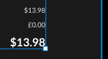

# Tebex Front End Quest

## Cairn's Notes

Still run the api with `npm run api`
Still run the client with `npm run dev`

I've completed the test, approaching it as if it were a component of a larger application. This perspective influenced my decision to use Pinia and Vue router. 

In the `BasketServices.js` file, I envisioned the potential for additional functions such as `addItem`, `removeItem`, `validateStockLevels`, etc. The store was used to manage the server response across different pages in the application, demonstrating its potential in a larger-scale project.

To ensure data persistence across page navigation and refreshes, all data in the store is also saved to local storage. This is also due to me treating this test as part of a larger application.

In the checkout you may notice that the sales tax uses `£` instead of `$`. I copied the design for this on purpose, normally i'd just change it over.

**Styling**
- I incorporated core styling using SCSS, primarily through variables and small utilities. However, to maintain component encapsulation, most of the CSS is contained within the respective component.

**Testing** 
- Basic tests have been added using `vitest`, focusing on the `BasketService`. Given that `BasketService` is the core of this application from a functionality standpoint and it leverages `DataServices`, these tests should cover most of the functionality related to endpoint interactions.